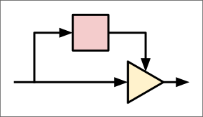
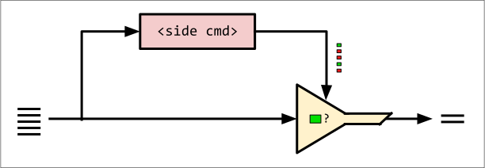
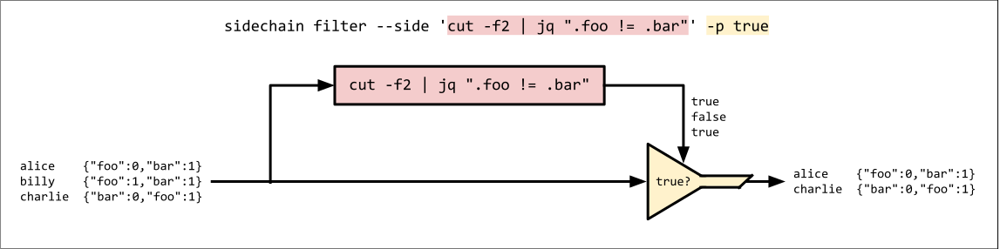
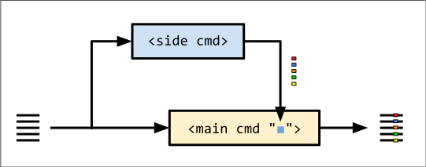
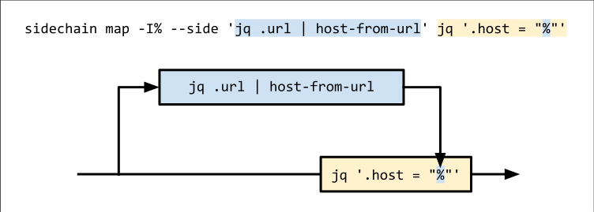
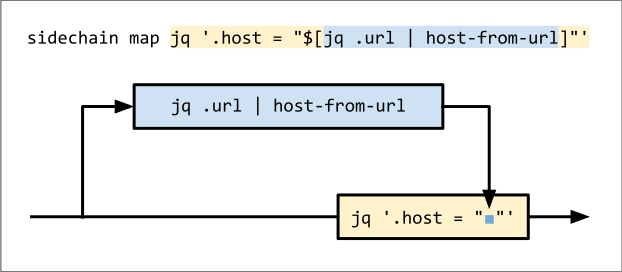
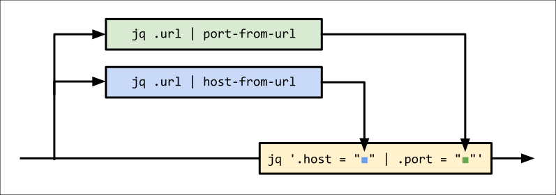
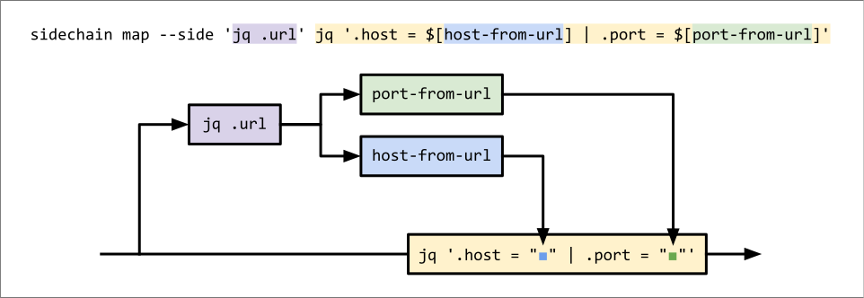

# sidechain

Split and merge Unix pipelines for filtering and data manipulation.



## What is it?

`sidechain` is a younger cousin of `xargs` and `awk` that fills a gap in the standard
line-processing tool set.

It extends the reach of shell-based data processing just enough to make a difference
for folks who still like to build load-bearing Unix pipelines.

### "Sidechain?"
The name and concept are borrowed from an [audio mixing
technique](https://www.sweetwater.com/insync/sidechaining-how-it-works-why-its-cool/)
in which an audio effect is controlled by a secondary audio signal.

For example, a compressor on a bass guitar might be controlled by a kick drum signal.
In this setup, the bass ducks out of the way on every kick drum hit, making for a
cleaner, punchier mix.

The side signal doesn't need to be from a different instrument. It could be a
filtered copy of the main signal. For example, a simple technique for [de-essing
vocals](https://en.wikipedia.org/wiki/De-essing#Side-chain_compression_or_broadband_de-essing)
is to use a compressor triggered by a high-pass-filtered copy of the main vocal
channel.

### Sidechaining in Unix Pipelines
In a data pipeline, we can use `sidechain` to control our critical path using a side
command or pipeline.



Use cases of `sidechain` are similar to those of `xargs` or `awk`, but `sidechain`
has one key benefit: **it does not spawn a new process for every line of input**.

## Filter Mode
Sometimes, you can't build the filter you need without removing critical parts of
your input.

With `sidechain filter`, you get to keep your original data, even if you use a
line-mangling filter.

### Example
Imagine we have lines of JSON-in-TSV:
```txt
# input.tsv
alice	{"foo":0,"bar":1}
billy	{"foo":1,"bar":1}
charlie	{"bar":0,"foo":1}
```
We want to filter this data to produce a list of users who have `.foo != .bar`. We
could use:
```bash
$ cut -f2 input.tsv | jq -c 'select(.foo != .bar)'
{"foo":0,"bar":1}
{"bar":0,"foo":1}
```
...but then we'd lose the usernames. What if we could use this filter _and_ keep our
original data?

#### Solution with `sidechain`
```bash
$ sidechain filter --side 'cut -f2 | jq ".foo != .bar"' -p true < input.tsv
alice	{"foo":0,"bar":1}
charlie	{"bar":0,"foo":1}
```
Arguments:
* `--side 'cut -f2 | jq ".foo != bar"'`: the side command; this prints `true` when
`.foo != .bar`.
* `-p true`: retain each line only if its side output matches the pattern `true`.



Here, we're telling `sidechain` to start the side command, pipe each line to it and
look for the pattern `true`. Matching lines are emitted
**in their original, unmangled form.**

Note: the side command is **spawned only once**. It's a long-running subprocess that
handles all input lines. Contrast this with a solution in `awk` or `bash`, which
would require invoking `jq` separately for every input line.

## Map Mode
In map mode, your side command generates values which can be merged back into your
main pipeline.



### Example
Suppose you have a file containing lines of JSON with a `"url"` field, and you want
to add a new `"host"` field containing the host component of the URL.

```json
{"name":"alice","url":"https://foo.com"}
{"name":"billy","url":"http://1.2.3.4:8000/api"}
```

It's not hard to extract the host. But how would you surgically do it for a URL
embedded in JSON?

#### Solution with `sidechain`
For readability, let's use an imaginary tool called `host-from-url` to extract the
hosts. In reality, you could use the Ruby one-liner
`ruby -r uri -ne 'u = URI($_.chomp); puts(u.host || "")'` (this reads from stdin and
parses all of the URLs with a single invocation).

```bash
sidechain map -I% --side 'jq .url | host-from-url' jq '.host = "%"' < input.json

#                        ^----- side command ----^ ^-- main cmd --^
```
Like with `xargs`, we can use `-I <replstr>` to define a placeholder for the values
generated by the side command.



Here, the side command `jq .url | host-from-url` extracts the hosts, which are then
inserted into the output of the main command, `jq '.host = "%"'`.

Remember, the side and main commands are both long-running processes. They are not
invoked for every line, as `xargs` would do.

## Using `$[]`
For cleaner, more-intuitive interpolation, you can use `$[]` to wrap your side
command:

```bash
sidechain map jq '.host = "$[jq .url | host-from-url]"' < input.json

#                            ^--- side command ----^
#             ^----------- main command --------------^
```



This has the same behavior as the `-I%` version; it's just another way to spell it.

## Multiple Side Commands
Map mode supports the use of _multiple side commands_.

Continuing with the URL-parsing example, imagine you want to extract the port from
the URL as well. Again, we'll use a placeholder (`port-from-url`) instead of a real
command that extracts ports from URLs.

```bash
sidechain map jq '
    .host = "$[jq .url | host-from-url]"
  | .port =  $[jq .url | port-from-url]
' < input.json
```



This is great, but it duplicates some work: we're running two copies of `jq .url`.

To prevent this, you can insert a preliminary side command that feeds into the
downstream ones:

```bash
sidechain map \
  --side 'jq .url' \
  jq '.host = "$[host-from-url]" | .port = $[port-from-url]' \
  < input.json
```


