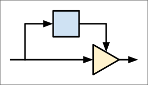
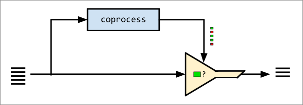
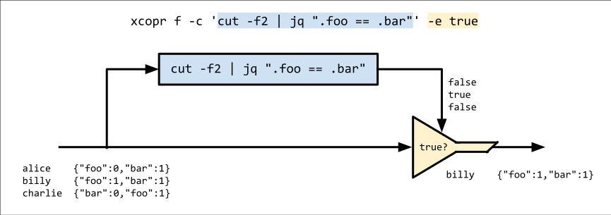
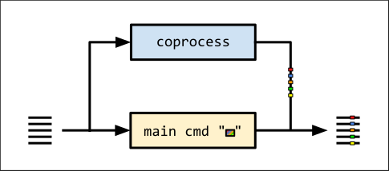

> [!NOTE]
> This README is a sketch. The tool has not been implemented yet.

# xcopr


`xcopr` adds ergonomic **coprocessing** to the classic Unix toolkit.

Like `xargs`, it plays a supporting role, allowing users to compose familiar tools
more easily. But unlike `xargs`, `xcopr` is designed for stream processing. It
extends the reach of pipeline-based shell programming by enabling users to **split
and rejoin data streams**.

## What Is a Coprocess?
A coprocess runs in parallel with a main process and communicates bidirectionally
with it.

Coprocesses are often overlooked in shell pipelines, understandably so: it's not easy
to use them that way.
[Bash](https://www.gnu.org/software/bash/manual/html_node/Coprocesses.html),
[ksh](https://www.ibm.com/docs/en/aix/7.1?topic=shell-coprocess-facility), and
[gawk](https://www.gnu.org/software/gawk/manual/html_node/Two_002dway-I_002fO.html)
have coprocessing features, and the technique can be achieved using any
general-purpose programming language. But all of these methods are too verbose to
serve as pipeline building blocks in practice.

## Use Cases
`xcopr` can help in these situations:
- Your data contains a mixture of encodings (e.g., base64 in TSV).
- You want to use a line-mangling filter (like `cut` or `jq`) but need to preserve
  the original lines for a later step in your pipeline.
- You want to use bulk database queries to enrich large, line-based datasets.
- You're using `xargs` or `awk` to run subprocesses, but don’t want to fork a new
  process per line.
- You want to combine tools in a seemingly-impossible way (e.g., splitting a pipeline
  into multiple branches).

## `xcopr` vs. Other Tools
<details>
<summary><code>xargs</code></summary>
<br>

Both `xargs` and `xcopr` help users compose other utilities more easily in shell pipelines.

But the similarities end there:
* `xargs` groups its stdin into batches which are distributed as arguments to fired-and-forgotten
  child processes; `xcopr` pipes its stdin to coordinated coprocesses whose outputs
  can be flexibly merged.
* `xargs` invokes the specified utility many times (once for each batch of
  arguments); `xcopr`'s coprocesses are long-lived.
* `xargs` does not support preservation of stdin for downstream processing; `xcopr`
  does.
* `xargs` does not support multiple coordinated subprocesses; `xcopr` does.
</details>

<details>
<summary><code>sed</code></summary>
<br>

Both `sed` and `xcopr` are used for line-based stream processing, and fit naturally
into pipelines.

However, while `sed`'s behavior is controlled by a dedicated scripting language,
`xcopr` uses coprocesses. Also, `sed` does not preserve original lines or support
multiple parallel processing streams, while `xcopr` does.
</details>

<details>
<summary><code>awk</code></summary>
<br>

`awk` is less of a shell utility, and more of a full-blown programming language. Its
GNU variant [supports
coprocessing](https://www.gnu.org/software/gawk/manual/html_node/Two_002dway-I_002fO.html),
as do many other programming languages. You can achieve what `xcopr` does using
Python, too.

By contrast, `xcopr` is not a programming language at all. It is a small command-line
utility designed for use in shell pipelines.
</details>

<details>
<summary><code>coproc</code> (bash)</summary>
<br>

Bash supports coprocessing via the `coproc` keyword, which lets you set up a
long-lived subprocess and communicate with it via its standard I/O streams. This
vaguely resembles what `xcopr` does, but `coproc` is a low-level feature requiring
careful, explicit management to avoid its
[pitfalls](https://bash-hackers.gabe565.com/syntax/keywords/coproc).

`coproc` also has key limitations:
* It's not pipeline-friendly
* It's not portable to other shells
* It doesn't support multiple coprocesses
</details>

<details>
<summary><code>expect</code></summary>
<br>

Like `xcopr`, `expect` enables configurable communication with long-running
subprocesses.

However, they differ greatly in their intended use cases and features:
* `expect` is designed for terminal automation (e.g., `telnet`, `ssh`, `passwd`),
  while `xcopr` is designed for stream processing.
* `expect` scripts manage control flow and simulate user input; `xcopr` focuses on
  piping data through coprocesses in a pipeline.
* `expect` runs standalone scripts; `xcopr` is meant to be used inline as part of a
  shell pipeline.
</details>


# Usage
## Filter Mode
In filter mode, the user specifies a coprocess whose output determines whether each
stdin line passes through.



### Basic Usage
```bash
xcopr filter -c COPROC -e PATTERN
```
Arguments:
* `-c COPROC`: the coprocess, stated as a shell command.
* `-e PATTERN`: the pattern to search for in the coprocess's output.

Lines are emitted in their original form, unaffected by any destructive changes
performed by `COPROC`.

### Example: JSON-in-TSV
```txt
# input.tsv
alice	{"foo":0,"bar":1}
billy	{"foo":1,"bar":1}
chuck	{"bar":0,"foo":1}
```
Print a list of users for whom `.foo == .bar`:
```bash
$ xcopr filter -c 'cut -f2 | jq ".foo == .bar"' -e true < input.tsv

# output
billy	{"foo":1,"bar":1}
```

Here, we're telling `xcopr` to start the coprocess, pipe each line to it, and look
for the pattern `true` in its output. Matching lines are emitted **in their original,
unmangled form.**



Remember: the `cut | jq` coprocess is **spawned only once**. It's a long-running
program that handles all input lines. Contrast this with a traditional shell loop,
which would invoke `cut | jq` separately for every line.

## Map Mode
In map mode, coprocesses **generate values** which can be injected back into the main
process's output.



### Basic Usage
```
xcopr map [-c COPROC | -p STRING ...] [COMMAND]
```
Arguments:
* `-c COPROC`: a coprocess, stated as a shell command, which generates a stream of
  lines. By default, each coprocess created this way receives a copy of `xcopr`'s
  stdin.
* `-p STRING`: a _printer_. Like a coprocess, a printer creates a stream of lines,
  but is specified as a templated string, potentially referencing other coprocesses
  or printers. This is a convenient stand-in for a coprocess like `awk '{print
  ...}'`.
* `COMMAND`: the command which generates the final output of `xcopr`. If omitted, the
  final output is that of the last-specified coprocess or printer.

Each coprocess (`-c`) and printer (`-p`) generates a stream (a sequence of lines).
These streams may be referenced by the main command, or by other coprocesses and
printers, using a simple substitution mechanism, described in greater detail below.

### Referencing Streams
Each stream may be referenced by its position in the `xcopr` command using `%1`,
`%2`, and so on. `%0` is the original stdin of `xcopr` itself.

These references are called "stream variables," and they are conceptually similar to
`\1` in `sed` or `$1` in `awk`: in the output of `xcopr`, a stream variable takes on
a different value for each line processed.

#### Example: Dynamic Word Reversal in JSON
```txt
# input.jsonl
{"word":"hello","msg":"hello world"}
```
Reverse instances of `.word` found in `.msg`:
```bash
$ xcopr map \
    -c 'jq -r .word | rev' \
    jq -c '.msg |= gsub(.word, "%1")' \
    < input.jsonl

# output
{"word":"hello","msg":"olleh world"}
```
Note: both `jq` commands, and `rev`, are long-lived, parallel processes that handle
all lines before exiting.

### Coprocess Substitution
A `%{cmd}` appearing anywhere in a coprocess command or printer creates a new
coprocess and refers to it in-place. This coprocess receives a copy of `xcopr`'s
stdin. This is equivalent to creating a stream using `-c` or `-p` and referring to it
with `%N`.

Similarly, `%N{cmd}` creates an in-place coprocess that receives stream `N` as its
stdin (so, `%0{cmd}` behaves exactly the same as `%{cmd}`).

#### Example: Bulk Redis Queries
Imagine we store user birthdays in Redis, keyed by user ID.

We want to enrich the following data by adding each user's birthday:
```txt
# input.jsonl
{"name":"alice","id":1}
{"name":"billy","id":2}

# output (using data from Redis)
{"name":"alice","id":1,"birthday":"1975-05-10"}
{"name":"billy","id":2,"birthday":"2010-06-20"}
```
The Redis CLI client can be used as a coprocess by piping queries to it. We can
perform the Redis lookups in bulk using a coprocess:
```bash
$ xcopr map \
    -p 'GET id:%{jq .id}' \
    jq -c '.birthday = "%1{redis-cli --raw}"' \
    < input.jsonl
```
As usual, all subprocesses (`redis-cli` and `jq`) are long-lived, parallel processes
that handle all lines before exiting.

#### Example: Bulk SQLite Queries
Imagine we have a SQL database containing DNS-like data:
```
sqlite> select * from dns;
id  domain   ip
--  -------  -------
1   foo.com  1.1.1.1
2   bar.com  2.2.2.2
```
We want to use this database to enrich a large dataset, annotating each domain with
its associated IP:
```txt
# input.jsonl
{"domain":"foo.com"}
{"domain":"bar.com"}

# output (using data from SQLite)
{"domain":"foo.com","ip":"1.1.1.1"}
{"domain":"bar.com","ip":"2.2.2.2"}
```
We can perform the SQL queries in bulk using a coprocess:
```bash
$ xcopr map \
    -p "SELECT ip FROM dns WHERE domain = '%{jq -r .domain}'" \
    jq -c '.ip = "%1{sqlite3 -list dns.db}"' \
    < input.jsonl
```
Again, all subprocesses (`sqlite3` and `jq`) are long-lived, parallel processes that
handle all lines before exiting.
