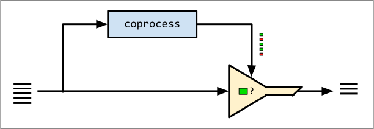

> [!NOTE]
> This README is a sketch. The tool has not been implemented yet.

# xcopr


`xcopr` adds ergonomic **coprocessing** to the classic Unix toolkit.

Like `xargs`, it plays a supporting role, allowing users to compose familiar tools
more easily. But unlike `xargs`, `xcopr` is designed for stream processing. It
extends the reach of pipeline-based shell programming by enabling users to **split
and rejoin data streams**.

## What is a coprocess?
A coprocess runs in parallel with a main process and communicates bidirectionally
with it.

Coprocesses are often overlooked in shell pipelines, understandably so: it's not easy
to use them that way.
[Bash](https://www.gnu.org/software/bash/manual/html_node/Coprocesses.html),
[ksh](https://www.ibm.com/docs/en/aix/7.1?topic=shell-coprocess-facility), and
[gawk](https://www.gnu.org/software/gawk/manual/html_node/Two_002dway-I_002fO.html)
have coprocessing features, and the technique can be achieved using any
general-purpose programming language. But all of these methods are too verbose to
serve as pipeline building blocks in practice.

## Use cases
`xcopr` can help in these situations:
- Your data contains a mixture of encodings (e.g., base64 in TSV).
- You want to use a line-mangling filter (like `cut` or `jq`) but need to preserve
  the original lines for a later step in your pipeline.
- You want to use bulk database queries to enrich large, line-based datasets.
- You're using `xargs` or `awk` to run subprocesses, but don’t want to fork a new
  process per line.
- You want to combine tools in a seemingly-impossible way (e.g., splitting a pipeline
  into multiple branches).

## `xcopr` vs. other tools
<details>
<summary><code>xargs</code></summary>
<br>

Both `xargs` and `xcopr` help users compose other utilities more easily in shell pipelines.

But the similarities end there:
* `xargs` groups its stdin into batches which are distributed as arguments to fired-and-forgotten
  child processes; `xcopr` pipes its stdin to coordinated coprocesses whose outputs
  can be flexibly merged.
* `xargs` invokes the specified utility many times (once for each batch of
  arguments); `xcopr`'s coprocesses are long-lived.
* `xargs` does not support preservation of stdin for downstream processing; `xcopr`
  does.
* `xargs` does not support multiple coordinated subprocesses; `xcopr` does.
</details>

<details>
<summary><code>sed</code></summary>
<br>

Both `sed` and `xcopr` are used for line-based stream processing, and fit naturally
into pipelines.

However, while `sed`'s behavior is controlled by a dedicated scripting language,
`xcopr` uses coprocesses. Also, `sed` does not preserve original lines or support
multiple parallel processing streams, while `xcopr` does.
</details>

<details>
<summary><code>awk</code></summary>
<br>

`awk` is less of a shell utility, and more of a full-blown programming language. Its
GNU variant [supports
coprocessing](https://www.gnu.org/software/gawk/manual/html_node/Two_002dway-I_002fO.html),
as do many other programming languages. You can achieve what `xcopr` does using
Python, too.

By contrast, `xcopr` is not a programming language at all. It is a small command-line
utility designed for use in shell pipelines.
</details>

<details>
<summary><code>coproc</code> (bash)</summary>
<br>

Bash supports coprocessing via the `coproc` keyword, which lets you set up a
long-lived subprocess and communicate with it via its standard I/O streams. This
vaguely resembles what `xcopr` does, but `coproc` is a low-level feature requiring
careful, explicit management to avoid its
[pitfalls](https://bash-hackers.gabe565.com/syntax/keywords/coproc).

`coproc` also has key limitations:
* It's not pipeline-friendly
* It's not portable to other shells
* It doesn't support multiple coprocesses
</details>

<details>
<summary><code>expect</code></summary>
<br>

Like `xcopr`, `expect` enables configurable communication with long-running
subprocesses.

However, they differ greatly in their intended use cases and features:
* `expect` is designed for terminal automation (e.g., `telnet`, `ssh`, `passwd`),
  while `xcopr` is designed for stream processing.
* `expect` scripts manage control flow and simulate user input; `xcopr` focuses on
  piping data through coprocesses in a pipeline.
* `expect` runs standalone scripts; `xcopr` is meant to be used inline as part of a
  shell pipeline.
</details>


# Usage
## Filter mode
In filter mode, the user specifies a coprocess whose output determines whether each
stdin line passes through.



### Basic usage
```bash
xcopr filter -c COPROC -e PATTERN
```
Arguments:
* `-c COPROC`: the coprocess, stated as a shell command.
* `-e PATTERN`: the pattern to search for in the coprocess's output.

Lines are emitted in their original form, unaffected by any changes performed by
`COPROC`.

### Example: JSON-in-TSV
Imagine we have the following JSON-in-TSV data, and we want a list of users having
`.foo == .bar`:
```txt
# input.tsv
alice	{"foo":0,"bar":1}
billy	{"foo":1,"bar":1}
chuck	{"bar":0,"foo":1}

# desired output:
billy	{"foo":1,"bar":1}
```
To do this with `xcopr`:
```bash
xcopr filter -c 'cut -f2 | jq ".foo == .bar"' -e true < input.tsv
```

Here, we're telling `xcopr` to start the coprocess, pipe each line to it, and look
for the pattern `true` in its output. Matching lines are emitted **in their original,
unmangled form.**


Remember: the `cut | jq` coprocess is **spawned only once**. It's a long-running
program that handles all input lines. Contrast this with a traditional shell loop,
which would invoke `cut | jq` separately for every line.

## Map mode
In map mode, coprocesses **generate values** which can be injected back into the main
process's output.


Example use cases:
* Using a coprocess to operate on a subsection of each line, and reintegrating the
  result back into each original line.
* Enriching large, line-based datasets using bulk database lookups (i.e., opening
  only one database connection).

### Basic usage
```
xcopr map [-c COPROC | -s STRING ...] [COMMAND]
```
Arguments:
* `-c COPROC`: a coprocess, stated as a shell command, which generates a stream of
  lines. By default, each coprocess created this way receives a copy of `xcopr`'s
  stdin.
* `-s STRING`: a _stream template_. Like a coprocess, it generates a stream of lines,
  but is specified as a templated string containing references to other coprocesses
  or stream templates. This is a convenient stand-in for a coprocess like `awk
  '{print ...}'`.
* `COMMAND`: the command which generates the final output of `xcopr`. If omitted, the
  final output is that of the last-specified coprocess or stream template.

Each coprocess (`-c`) and stream template (`-s`) generates a _stream_ (a sequence of
lines). Streams may be referenced using a substitution mechanism described in detail
below.

### Referencing streams
Each stream may be referenced by its position in the `xcopr` command using `%1`,
`%2`, and so on. `%0` is the original stdin of `xcopr` itself.

A stream reference is conceptually similar to `\1` in `sed` or `$1` in `awk`: it
takes on a different value for each processed line.

### Example: Dynamic word-reversal in JSON
Suppose we have a file containing line-delimited JSON, and we want to use a coprocess
to operate on one of the JSON fields, then reintegrate it into the final output.

For example, let's say we have the following data, and we want to reverse instances
of `.word` found in `.msg`:
```txt
# input.jsonl
{"word":"hello","msg":"hello world"}

# desired output
{"word":"hello","msg":"olleh world"}

```
We're not sure if `jq` can do this, but we know
[rev(1)](https://man7.org/linux/man-pages/man1/rev.1.html) can reverse lines.

We can use `rev` in a coprocess with `xcopr`:
```bash
xcopr map \
  -c 'jq -r .word | rev' \
  jq -c '.msg |= gsub(.word, "%1")' \
  < input.jsonl
```


Note: both of the `jq` commands, and `rev`, are long-lived, parallel processes that
handle all lines before exiting.

### Coprocess substitution
A `%{cmd}` appearing anywhere in a coprocess command or stream template creates a new
coprocess and refers to it in-place. This coprocess receives a copy of `xcopr`'s
stdin. This is equivalent to creating a stream using `-c` or `-s` and referring to it
with `%N`.

Similarly, `%N{cmd}` creates an in-place coprocess that receives stream `N` as its
stdin (so, `%0{cmd}` behaves exactly the same as `%{cmd}`).

### Example: Bulk Redis queries
Imagine we store user birthdays in Redis, keyed by user ID.

We want to enrich the following data by adding each user's birthday:
```txt
# input.jsonl
{"name":"alice","id":1}
{"name":"billy","id":2}

# output (using data from Redis)
{"name":"alice","id":1,"birthday":"1975-05-10"}
{"name":"billy","id":2,"birthday":"2010-06-20"}
```
The Redis CLI client can be used as a coprocess by piping queries to it. We can
perform the Redis lookups in bulk using a coprocess:
```bash
xcopr map \
  -s 'GET id:%{jq .id}' \
  jq -c '.birthday = "%1{redis-cli --raw}"' \
  < input.jsonl
```


As usual, all subprocesses (`redis-cli` and `jq`) are long-lived, parallel processes
that handle all lines before exiting.

# How stream references work
`xcopr` assigns a unique token to each stream, e.g. `__XCOPR_001__`.

Before invoking any commands, `xcopr` replaces all stream references (`%1`, `%{}`,
etc) with their corresponding tokens.

For example, the command:
```
jq -c '.birthday = "%1{redis-cli --raw}"'
```
becomes something like:
```
jq -c '.birthday = "__XCOPR_003__"'
```

Then, on the output side of each process, each token is replaced with the values
generated by the token's corresponding stream (the kth line receives the kth value
generated by the stream).

For example, each value generated by `redis-cli --raw` is inserted into `jq`'s
_output_, replacing each instance of `__XCOPR_003__`.

So,
```
{"name":"alice","id":1,"birthday":"__XCOPR_003__"}
{"name":"billy","id":2,"birthday":"__XCOPR_003__"}
```
becomes:
```
{"name":"alice","id":1,"birthday":"1975-05-10"}
{"name":"billy","id":2,"birthday":"2010-06-20"}
```
